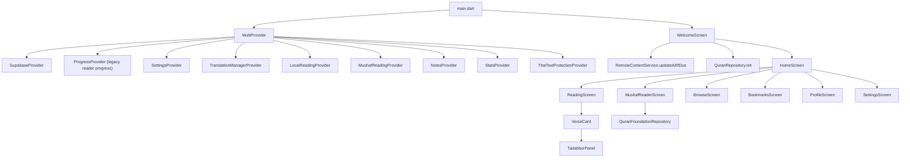
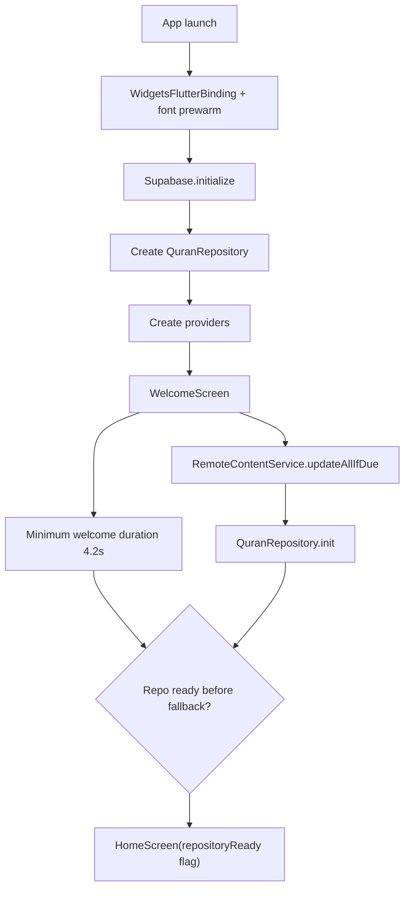
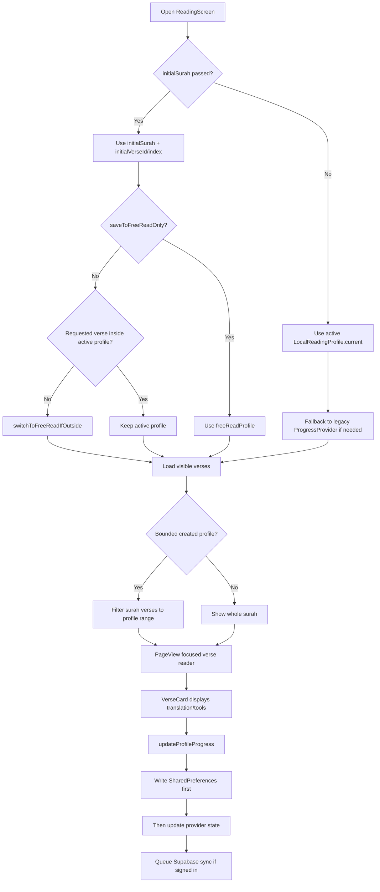
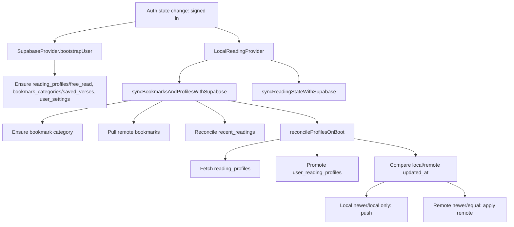
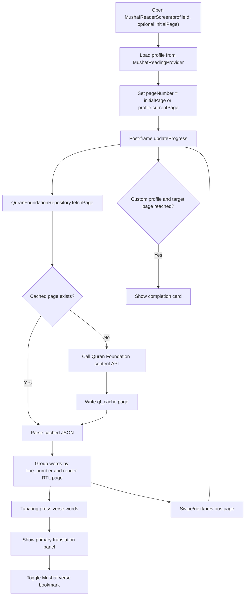
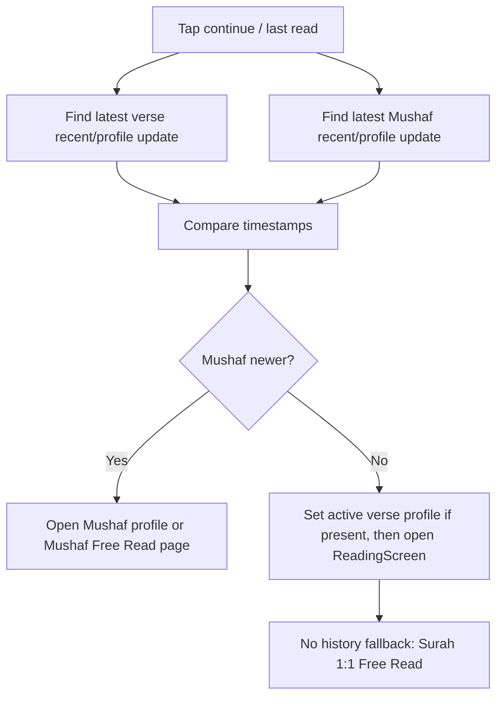

# Thai Quran App to Web Migration Study

Source repo: `H:\gits\thai-quran-app`  
Target repo: `H:\gits\thai-quran-web`  
Status: research only; no web changes made.

## Executive Summary

The Flutter app is now a local-first Quran reading product with two independent reading tracks:

- Meaningful verse reading, owned by `LocalReadingProvider`.
- Mushaf page reading, owned by `MushafReadingProvider`.

Both tracks support a default open reading lane called Free Read / Just Read, plus user-created bounded goals. The web app should copy the behavioral contracts first, then adapt the UI to web.

Important migration priority:

1. Preserve guest use.
2. Use Supabase only for sync/backup/community features.
3. Keep verse reading and Mushaf reading as separate state machines.
4. Make Free Read / Just Read canonical and non-editable.
5. Use disk/local persistence before in-memory progress changes.

## App Architecture



## Startup Flow



`WelcomeScreen` also has an 8 second fallback timer so the user is not blocked forever if remote content or repository init is slow.

## Main Navigation Model

`HomeScreen` is the hub. It exposes:

- Meaningful Read / verse reader.
- Mushaf Read / page reader.
- Tadabbur private screen.
- Bookmarks screen.
- Profile/account screen.
- Quick links, including locked system links for Surah Al-Mulk and Al-Kahf.

The strongest web requirement is not to copy the mobile layout literally. Copy these decisions:

- One clear continue-reading action that chooses the newest state across verse and Mushaf tracks.
- Separate cards/lists for verse goals and Mushaf goals.
- Browse/search opens casual reading into Free Read, not a bounded goal.
- Quick links are local-first and sync to `custom_quick_links` for signed-in users.

## Verse Reading Model

`LocalReadingProvider` owns the modern verse reading system. It stores:

- `activeProfileId`
- `profiles`
- `bookmarkCategories`
- `bookmarks`
- `recentReadings`
- `readDates`

Local storage key:

```text
thai_quran_local_reading_store_v1
```

### Profile Shape

`LocalReadingProfile` fields:

- `id`
- `userId`
- `name`
- `slug`
- `planMode`
- `startJuz`
- `targetJuz`
- `start`
- `target`
- `current`
- `lastViewed`
- `sortOrder`
- `isArchived`
- `createdAt`
- `updatedAt`

`current` is the furthest unread/advanced position. `lastViewed` is where the reader last looked, even if it is behind `current`.

### Free Read / Just Read

The app treats these as the same canonical concept:

- slug `free_read`
- legacy slug `main_read`
- name `Free Read`
- name `Just Read`
- legacy name `Main Read`

Web should use one product label consistently, but preserve compatibility with all legacy values.

Rules:

- Every user context should have one Free Read profile.
- Guest user id is `local`.
- Free Read cannot be edited, archived, or deleted.
- Free Read has no target range.
- Free Read can save progress anywhere in the Quran.
- If custom active profiles exist, profile lists hide Free Read except where a fallback/open lane is needed.

### Created Profile Rules

- Maximum active created verse profiles: 5.
- Archived profiles do not count toward the limit.
- Plan modes: `by_juz`, `by_surah`, `by_ayat`, `custom`.
- Editing a profile resets current progress to the new start.
- Bounded profiles only show verses inside `[start, target]`.
- If a requested verse is outside the active bounded profile, the app switches to Free Read.

## Verse Reader Flow



## Disk-First Progress Contract

`updateProfileProgress` is deliberately disk-first:

1. Load provider state.
2. Reject update if the verse is outside the target profile range.
3. Mark reading date.
4. Calculate absolute verse index.
5. Build updated profile list in memory, but do not commit it yet.
6. Write `user_reading_state_updated_at`.
7. Write full serialized local reading store.
8. Only after storage succeeds, replace provider memory and notify listeners.
9. Queue profile sync.
10. If Free Read and signed in, debounce `user_reading_state` sync.

The web must not show progress as saved unless local persistence succeeded.

## Recent Reading Contract

Verse recent readings:

- Stored locally in the local reading store.
- Limit: 20.
- Upsert behavior is per user and surah locally.
- `profileId` is kept only if the verse is inside that profile range.
- Supabase table: `recent_readings`.
- New shape: `surah_id`, `verse_id`, `read_at`, `profile_id`.
- Legacy fallback shape: `last_read_verse`, `updated_at`.

## Supabase Sync: Verse Reading



Remote tables touched:

- `reading_profiles`
- `user_reading_profiles` legacy
- `bookmark_categories`
- `bookmarks`
- `recent_readings`
- `user_reading_state`
- `user_settings`
- `user_reading_history`
- `tadabbur_notes`
- `tadabbur_likes`
- `custom_quick_links`

## Bookmarks

Verse bookmarks are separate saved verse rows, not profile slots.

Local:

- `LocalBookmarkCategory`
- `LocalBookmark`
- Default category `Saved Verses`
- Default max items in shared contract is 9999, but bootstrap sometimes uses 5.

Remote:

- `bookmark_categories`
- `bookmarks`

Behavior:

- Toggle by exact `surahId:verseId` for current user.
- Signed-in add inserts remote first when possible.
- Guest add writes local.
- On sign-in, remote bookmarks replace signed-in user bookmarks locally.

Migration note: standardize category `max_items` between app and web. App currently has both 9999 and 5 in different paths.

## Settings

Local keys include:

- `isDarkMode`
- `keepAwake`
- `readingDisplayMode`
- `arabicFontSize`
- `translationFontSize`
- `themeColor`
- `languageCode`
- `webHostUrl`
- `primaryTranslationId`
- `secondaryTranslationId`
- `settingsUpdatedAt`

Display modes:

- `quran_only`
- `translation_only`
- `quran_translation`

Translation slots:

- Primary is required.
- Secondary is optional.
- Built-in bundled ID is currently `thai_v3`.
- Other IDs are numeric downloaded translation IDs from `TranslationDatabase`.
- If primary becomes equal to secondary, secondary is cleared.
- If secondary equals primary, secondary update is rejected.

Settings sync:

- Pull `user_settings`.
- Compare local `settingsUpdatedAt` to remote `updated_at`.
- If local is newer, push local.
- Otherwise apply remote and write it to local prefs.

Migration note: web currently knows `thai_v2` and `english` as explicit IDs; the app’s current provider makes `showThaiV2` and `showEnglish` false and expects non-bundled translations to be downloaded numeric IDs. This needs a deliberate product decision.

## Quran Content Loading

`QuranRepository` loads:

- Arabic from `assets/quran_arabic.json`.
- Thai v3 from `RemoteContentService` with bundled fallback `assets/thai_v3.json`.
- Merged translations from `assets/merged_quran.json`.
- Thai Mokhtasar tafsir from `RemoteContentService` with bundled fallback `assets/tafsir_thai_mokhtasar.json`.
- Surah names from `https://api.quran.com/api/v4/chapters`, with fallback names.

`RemoteContentService`:

- Checks `app_content_versions`.
- Downloads updated JSON files from Supabase Storage bucket `app-content`.
- Validates JSON before caching.
- Caches body differently for IO and web.

Remote content keys:

- `thai_v3`
- `tafsir_thai_mokhtasar`
- `quran_themes`

## Verse Card Tools

`VerseCard` handles per-ayah actions:

- Save/update Tadabbur note.
- Bookmark toggle.
- Copy text.
- Share image.
- Short tafsir toggle.
- Report translation issue.
- Audio play/stop.
- Community notes modal.
- Progress update when verse is viewed.

Important: the fixed action menu in `ReadingScreen` proxies actions through `VerseCardController`, so the active verse owns the real behavior.

## Tadabbur Notes

Local storage key:

```text
personal_notes_v2
```

Local model:

- Map by `surahId:verseId`.
- Empty note text can represent a favorite/saved verse in some Mushaf flows.
- Guest notes stay local.
- Signed-in notes sync to Supabase.

Remote:

- `tadabbur_notes`
- `tadabbur_likes`
- RPC: `toggle_tadabbur_like`

Community notes:

- Fetched from `tadabbur_notes` where `is_public = true`.
- Joined likes are used to compute whether the current user liked the note.
- Ordered newest first.

Migration note: web should separate “favorite/no note text” from “private reflection” if the product wants clearer semantics.

## Stats / Reading History

Local storage key:

```text
reading_history_v1
```

Shape:

- Map date `YYYY-MM-DD` to set of verse keys.
- Logs unique verses per day.

Remote:

- `user_reading_history`

Derived stats:

- today read count
- week read count
- month read count
- streak count

## Mushaf Reading Model

`MushafReadingProvider` is separate from `LocalReadingProvider`.

Local storage key:

```text
thai_quran_mushaf_store_v1
```

Stored data:

- `activeProfileId`
- `displayMushafId`
- `profiles`
- `pageBookmarks`
- `verseBookmarks`
- `deletedPageBookmarkKeys`
- `deletedVerseBookmarkKeys`
- `recentReadings`

Visible Mushaf layouts:

- `1` QCF V2, 604 pages
- `2` QCF V1, 604 pages
- `4` Uthmani Hafs, 604 pages
- `6` IndoPak, 610 pages
- `11` Tajweed, 604 pages
- `19` QCF Tajweed V4, 604 pages

Defined but not currently visible:

- `3` IndoPak, 604 pages
- `5` KFGQPC Hafs, 604 pages
- `7` IndoPak 16-line, 548 pages
- `20` QCF Package, 604 pages

Current default mismatch:

- Behavior docs say default Mushaf should be `1` / QCF V2.
- Provider `displayMushafId` defaults to `2`.
- `openUnifiedFreeRead()` opens mushaf `1`.

Web should choose a single default and use it consistently.

## Mushaf Profile Rules

- Maximum active custom Mushaf profiles: 5 in code.
- App behavior doc previously said 3; code now says 5.
- Free Read profile id is `mushaf-free-{mushafId}`.
- Free Read name is normalized to `Just Read`.
- Free Read slug is `mushaf_free_read`.
- Custom profiles are page ranges.
- Surah and Juz goals convert to page ranges using Madani page tables.
- Progress clamps to profile start/target range.
- `currentPage` is furthest unread page.
- `lastViewedPage` is the actual last viewed page.

## Mushaf Reader Flow



## Quran Foundation Integration

`QuranFoundationRepository` handles:

- Page fetching.
- Page/range lookups.
- Ayah and chapter recitation URLs.
- Font loading.
- Token/auth resolution.
- JSON cache in `SharedPreferences`.

Configuration sources:

- Dart defines.
- `.env` for local development.
- Defaults in code.

Important constants:

- Content base default: `https://apis.quran.foundation/content/api/v4`
- Prelive default also exists.
- Client id and auth token are required for authenticated content calls.

Mushaf id mapping:

- Internal QCF package id `20` maps to content mushaf `1`.
- Internal `19` maps to content mushaf `4`.
- Others map to themselves.

Cache prefix:

```text
qf_cache_v2
```

## Mushaf Bookmarks and Recent

Page bookmark key:

```text
{mushafId}-{pageNumber}
```

Verse bookmark key:

```text
{mushafId}|{pageNumber}|{verseKey}
```

Remote tables:

- `mushaf_page_bookmarks`
- `mushaf_verse_bookmarks`
- `mushaf_recent_readings`
- `mushaf_profiles`

Deleted bookmark keys are stored locally so sign-in sync can flush deletes that happened offline.

## Last Read Selection

Home chooses between verse and Mushaf tracks by comparing timestamps:



## Data Tables Web Should Support

Core:

- `reading_profiles`
- `bookmark_categories`
- `bookmarks`
- `recent_readings`
- `user_reading_state`
- `user_settings`
- `user_reading_history`

Mushaf:

- `mushaf_profiles`
- `mushaf_page_bookmarks`
- `mushaf_verse_bookmarks`
- `mushaf_recent_readings`

Content:

- `app_content_versions`
- Supabase Storage bucket `app-content`

Community:

- `tadabbur_notes`
- `tadabbur_likes`
- RPC `toggle_tadabbur_like`

User convenience:

- `custom_quick_links`

Legacy compatibility:

- `user_reading_profiles`
- legacy `recent_readings.last_read_verse`

## Migration Gaps to Resolve Before Editing Web

1. Naming: choose final user-facing label for Free Read / Just Read and keep legacy parsing.
2. Mushaf default: choose `1` or `2`; code currently uses both in different paths.
3. Mushaf profile limit: docs say 3, code says 5.
4. Bookmark category limit: docs/shared contract say 9999, some bootstrap code says 5.
5. Translation slots: app currently only treats `thai_v3` as bundled; web may still expose `thai_v2` and `english`.
6. Supabase profile source: app now promotes legacy `user_reading_profiles` but syncs `reading_profiles`; web should prefer `reading_profiles`.
7. Favorite vs Tadabbur note: empty note text is used as favorite in places; web should decide whether to keep or split.
8. Remote content update: decide whether web should use the same `app_content_versions` + storage flow or keep bundled static data first.
9. Encoding/copy: some existing Dart source strings show mojibake; avoid copying those literals into web.

## Recommended Web Implementation Order

1. Shared contract constants and verse refs.
2. Local-first reading store with disk-first progress writes.
3. Free Read / Just Read compatibility and default profile creation.
4. Created profile range filtering and active profile behavior.
5. Browse/search always saving to Free Read unless explicitly opening a goal.
6. Recent readings and unified last-read selector.
7. Bookmarks with category support.
8. Settings with display mode and translation slots.
9. Supabase sync for profiles, recent, bookmarks, settings, and reading state.
10. Stats/history sync.
11. Tadabbur private/community notes.
12. Mushaf reading store, profiles, bookmarks, and recent pages.
13. Quran Foundation page rendering and font handling.
14. Remote content update flow.

## Source Files Studied

- `lib/main.dart`
- `lib/screens/welcome_screen.dart`
- `lib/screens/home_screen.dart`
- `lib/screens/reading_screen.dart`
- `lib/screens/mushaf_reader_screen.dart`
- `lib/widgets/verse_card.dart`
- `lib/providers/local_reading_provider.dart`
- `lib/providers/mushaf_reading_provider.dart`
- `lib/providers/supabase_provider.dart`
- `lib/providers/settings_provider.dart`
- `lib/providers/notes_provider.dart`
- `lib/providers/stats_provider.dart`
- `lib/providers/translation_manager_provider.dart`
- `lib/data/quran_repository.dart`
- `lib/data/quran_foundation_repository.dart`
- `lib/data/tadabbur_repository.dart`
- `lib/services/remote_content_service.dart`
- `lib/models/mushaf_models.dart`
- `lib/shared/quran_contract.dart`
- `docs/app-behavior.md`
- `docs/UPGRADE_CONTRACT.md`
